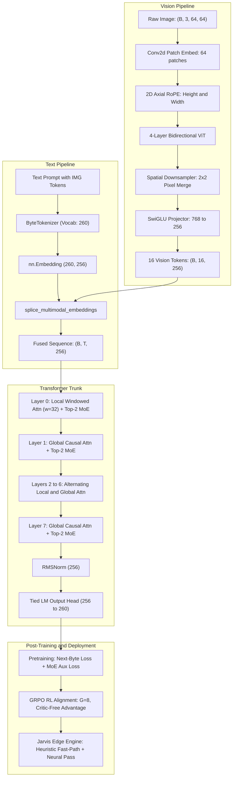

# 🔬 Micro-VLM: A 17.5M Multimodal MoE Architecture From Scratch

[](LICENSE)
[](https://www.python.org/)
[](https://pytorch.org/)
[](src/model.py)
[](src/jarvis_engine.py)

> **Looking for a non-technical explanation?**  
> Read the companion [Layman's Guide](README_LAYMAN.md).

---

## Table of Contents
1. [The Big Picture: What We Actually Built](#1-the-big-picture-what-we-actually-built)
2. [Architectural Blueprint & Specifications](#2-architectural-blueprint--specifications)
3. [Deep-Dive Component Design](#3-deep-dive-component-design)
   - [Byte-Level Tokenization (260-Byte Vocab)](#31-byte-level-tokenization-260-byte-vocab)
   - [Vision Tower: 2D RoPE, Downsampling & SwiGLU Projection](#32-vision-tower-2d-rope-downsampling--swiglu-projection)
   - [Multimodal Embedding Splicing](#33-multimodal-embedding-splicing)
   - [Language Trunk: Hybrid Attention, Top-2 MoE & Hyperconnections](#34-language-trunk-hybrid-attention-top-2-moe--hyperconnections)
4. [Post-Training: Group Relative Policy Optimization (GRPO)](#4-post-training-group-relative-policy-optimization-grpo)
5. [The Edge Engine: Jarvis Intent Router](#5-the-edge-engine-jarvis-intent-router)
6. [Debugging War Stories & Numerical Post-Mortem](#6-debugging-war-stories--numerical-post-mortem)
7. [Training Progression & Empirical Results](#7-training-progression--empirical-results)
8. [Repository File Map](#8-repository-file-map)
9. [Quickstart & Reproduction Guide](#9-quickstart--reproduction-guide)

---

## 1. The Big Picture: What We Actually Built

When research tutorials mention *"training modern foundation models from scratch,"* they usually mean downloading pre-trained Hugging Face checkpoints and fine-tuning adapters on a cluster of GPUs.

**This project is a reproduction of the architectural blueprint of modern lightweight multimodal models (such as GLM-Flash, DeepSeek-V3, and LLaMA-3) written strictly from the ground up in pure PyTorch.**

### Why We Built It
We wanted to demystify how frontier multimodal AI actually works under the hood without hiding behind third-party abstractions or multi-million-dollar compute budgets:
1. **Understand True Multimodal Fusion**: How visual pixels and text bytes actually merge into a single stream of thought without external clip encoders.
2. **Eliminate Dictionary Bloat**: How a model can read every language on Earth using just 260 raw byte IDs instead of a 50,000-word dictionary that consumes all its parameters.
3. **Sparse Computing via Mixture-of-Experts**: How to give a model the capacity of a large network while only activating 2 out of 4 experts per token, allowing it to run smoothly on a consumer CPU.
4. **Critic-Free Self-Alignment**: How DeepSeek's Group Relative Policy Optimization (GRPO) teaches an AI strict deductive reasoning using group trial-and-error without an expensive second critic network.

### How Everything Was Built (Component by Component)
* **Byte-Level Ingestion ([src/model/tokenizer.py](src/model/tokenizer.py))**: A 260-token UTF-8 byte scheme (0–255 raw bytes, plus `<PAD>`, `<BOS>`, `<EOS>`, and ``). No OOV tokens, zero dependency on external tokenizers.
* **Vision Eye & 2D Geometry ([src/model/vision.py](src/model/vision.py))**: An $8\times8$ patch ViT with **2D axial rotary embeddings (2D RoPE)** that encode height and width simultaneously, compressed $4\times$ by a $2\times2$ pixel-merge downsampler ($64 \to 16$ tokens), and projected via SwiGLU into language space ($D=256$).
* **Multimodal Splicer**: In the text prompt, wherever `` appears, the placeholder embedding is dynamically overwritten with the projected vision token.
* **MoE Language Trunk ([src/model/transformer.py](src/model/transformer.py))**: An 8-layer Transformer alternating between sliding-window local attention ($w=32$) and global causal attention, routed across 4 SwiGLU experts (top-2 active per token) with Switch Transformer load-balancing loss and learned hyperconnection residual scaling.
* **RL Alignment ([src/training/grpo_rl.py](src/training/grpo_rl.py))**: Uses GRPO with group rollouts ($G=8$), freezing the vision tower and lower 6 layers to protect visual-spatial features while steering reasoning from $15\%$ to $50\%$ accuracy on Boolean deduction.
* **Edge Engine ([src/serve/jarvis_engine.py](src/serve/jarvis_engine.py))**: Sub-millisecond ($<0.15\text{ ms}$) regex fast-path for direct OS commands with CPU neural fallback ($\sim 130\text{ ms}$) and cloud escalation.



#### Architecture Flow (Text / ASCII View)
```
[ Image: (3, 64, 64) ] ──► [ Conv2d (8x8) ] ──► [ 2D RoPE ] ──► [ ViT (4L) ] ──► [ 2x2 Merge ] ──► [ SwiGLU ] ──► 16 Tokens ──┐
                                                                                                                          │
[ Text + *16   ] ──► [ ByteTokenizer ] ──► [ Embedding ] ────────────────────────────────────────► [ Splicer ] ◄─────┘
                                                                                                        │
                                                ┌───────────────────────────────────────────────────────┘
                                                ▼
     [ Trunk: 8 Layers alternating Local (w=32) & Global Attention + Top-2 MoE (4 Experts) ]
                                                │
                                                ▼
     [ RMSNorm ] ──► [ Tied LM Head (260) ] ──► [ Edge Engine: Fast Reflex (<0.15ms) vs Neural (~130ms) ]
```

---

## 2. Architectural Blueprint & Specifications

| Dimension / Hyperparameter | Value | Rationale |
| :--- | :--- | :--- |
| **Total Parameter Count** | **17,490,128** ($\approx 17.5\text{M}$) | Fits directly in consumer CPU cache; rapid edge inference |
| **Vocabulary Size ($V$)** | **260 tokens** | 256 UTF-8 bytes + 4 explicit control tokens; zero OOV |
| **Hidden Dimension ($D_{\text{model}}$)** | **256** | Optimal balance between representation and CPU FLOPS |
| **Transformer Layers ($L$)** | **8 layers** | Sufficient depth for hierarchical feature extraction |
| **Attention Heads ($H$)** | **8 heads** ($D_{\text{head}} = 32$) | Evenly split for 1D RoPE rotary coordinate pairs |
| **Attention Topology** | **Hybrid Local / Global** | Even layers: sliding window ($w=32$); Odd layers: full causal |
| **MoE Experts ($N$)** | **4 experts per layer** | 32 total experts across trunk; $4 \times$ capacity multiplier |
| **MoE Active Routing ($k$)** | **Top-2** | Sparse activation; activates only $50\%$ of FFN parameters per token |
| **FFN Intermediate Dim** | **512** ($2 \times D_{\text{model}}$) | SwiGLU gating structure with separate gate and up projections |
| **Vision Resolution ($H \times W$)** | **$64 \times 64 \times 3$** | Synthetic canvas for grounded spatial-visual reasoning |
| **ViT Architecture** | **4 layers, 192 dim, 3 heads** | Bidirectional attention with axial 2D RoPE positional shifts |
| **Vision Compression Factor** | **$4\times$ ($64 \to 16$ tokens)** | $2 \times 2$ pixel-merge downsampler prevents vision context bloat |

---

## 3. Deep-Dive Component Design

### 3.1. Byte-Level Tokenization (260-Byte Vocab)
*File: [`src/tokenizer.py`](src/tokenizer.py)*

Standard LLMs rely on subword Byte-Pair Encoding (BPE) vocabularies of 32,000 to 128,000 tokens. In a small model, an embedding table for 64,000 tokens of dimension 256 would consume **16.38M parameters**—eating up over $90\%$ of the entire model budget before adding a single transformer layer.

We employ an exact 260-token UTF-8 byte scheme:
* `0` to `255`: Raw byte identity mapping (`0x00` to `0xFF`).
* `256`: `<PAD>` (used as `ignore_index` in `CrossEntropyLoss`).
* `257`: `<BOS>` (Sequence initiator).
* `258`: `<EOS>` (Sequence and rollout terminator).
* `259`: `` (Placeholder slot where vision tokens are spliced).

```
Embedding Matrix: [260, 256] = 66,560 parameters (Tied with LM output head)
```

### 3.2. Vision Tower: 2D RoPE, Downsampling & SwiGLU Projection
*File: [`src/vision.py`](src/vision.py)*

Rather than using flat 1D linear projections, the vision encoder processes spatial structures natively:

1. **Patch Embedding**: `Conv2d(3, 192, kernel_size=8, stride=8)` creates an $8 \times 8$ grid of 64 spatial patches.
2. **Axial 2D RoPE**:
   Unlike 1D text position embeddings, images require horizontal ($x$) and vertical ($y$) positional awareness. For head dimension $D_h = 64$, we divide the dimension in half ($32$ dimensions each):
   $$\theta_{y, i} = \frac{y}{10000^{2i / (D_h / 2)}}, \quad \theta_{x, i} = \frac{x}{10000^{2i / (D_h / 2)}}$$
   The resulting rotation matrix applies $y$-frequencies to the first half and $x$-frequencies to the second half, preserving 2D spatial coordinate geometry under rotation.
3. **Bidirectional ViT**: 4 Transformer layers allow bidirectional cross-patch attention.
4. **$2 \times 2$ Spatial Downsampler**:
   Neighboring $2 \times 2$ patches are merged into a single vector:
   $$(B, H/2, 2, W/2, 2, C) \longrightarrow (B, (H/2)(W/2), 4C)$$
   This shrinks the sequence from **64 patches down to 16 tokens** ($4\times$ reduction) while expanding the feature depth from $192 \to 768$.
5. **SwiGLU Projector**:
   Projects compressed visual tokens into language space:
   $$\text{VisionTokens} = W_{\text{down}}\left(\text{SiLU}(W_{\text{gate}} x) \odot W_{\text{up}} x\right) \in \mathbb{R}^{B \times 16 \times 256}$$

### 3.3. Multimodal Embedding Splicing
*Function: `splice_multimodal_embeddings` in [`src/vision.py`](src/vision.py)*

The model dynamically fuses modalities in embedding space:
1. The text prompt is tokenized with `` tokens marking image placement (e.g., `"Visual *16 Question: Primary tint? Answer: red."`).
2. The text embedding layer maps the prompt to `(B, T, 256)`.
3. The splicing function locates all token indices matching `IMG_TOKEN_ID (259)` and replaces the placeholder vectors in-place with the 16 projected vision tokens.

### 3.4. Language Trunk: Hybrid Attention, Top-2 MoE & Hyperconnections
*File: [`src/transformer.py`](src/transformer.py) and [`src/model.py`](src/model.py)*

#### Hybrid Causal Attention
To reduce quadratic attention compute costs while preserving global receptive fields, attention layers alternate across the 8 blocks:
* **Even Layers ($0, 2, 4, 6$)**: Local windowed causal attention with a sliding band mask ($w = 32$).
* **Odd Layers ($1, 3, 5, 7$)**: Global causal attention attending across all prior tokens.

#### Mixture of Experts (MoE) with Auxiliary Load Balancing
Each FFN block contains 4 independent SwiGLU expert MLPs. For each token, router logits are computed:
$$s = \text{Softmax}(W_{\text{router}} x)$$
The top-2 experts are selected, and weights are renormalized:
$$\tilde{w}_k = \frac{w_k}{\sum_{j \in \text{top-2}} w_j}, \quad y = \sum_{k \in \text{top-2}} \tilde{w}_k \cdot \text{Expert}_k(x)$$

To prevent router collapse (where the network routes all tokens to one favorite expert), we compute the **Switch Transformer auxiliary load-balancing loss**:
$$\mathcal{L}_{\text{aux}} = N \sum_{i=1}^N P_i \cdot f_i$$
* $P_i$: Average routing probability allocated to expert $i$ across all tokens in the batch.
* $f_i$: Fraction of tokens actually routed to expert $i$.
* Added to the training objective with a weighting factor of $\lambda = 0.01$.

#### Hyperconnections (Residual Scaling)
To maintain gradient propagation across deep residual blocks without numerical explosion:
$$x_{l+1/2} = x_l + \alpha_{\text{attn}} \cdot \text{Attn}(\text{RMSNorm}(x_l))$$
$$x_{l+1} = x_{l+1/2} + \alpha_{\text{moe}} \cdot \text{MoE}(\text{RMSNorm}(x_{l+1/2}))$$
where $\alpha_{\text{attn}}$ and $\alpha_{\text{moe}}$ are learnable parameters initialized to $0.5$.

---

## 4. Post-Training: Group Relative Policy Optimization (GRPO)
*File: [`src/grpo.rl.py`](src/grpo.rl.py)*

Standard PPO requires training a separate Value/Critic network, doubling memory consumption and training overhead. In **GRPO** (popularized by DeepSeek-Math and DeepSeek-R1), the value network is eliminated entirely by evaluating advantage relative to a sampled group:

```
For each reasoning prompt:
  1. Policy rollout samples G = 4 distinct completions: {o_1, o_2, o_3, o_4}
  2. Deterministic reward function scores each completion: R_i
  3. Advantage normalization across group:
       A_i = (R_i - mean(R)) / (std(R) + eps)
  4. Policy gradient update on generated completion tokens:
       L_GRPO = -min(r_t * A_i, clip(r_t, 1 - eps, 1 + eps) * A_i) + beta * D_KL(pi_ref || pi_theta)
```

### Reward Formulation for Boolean Logic
* `+1.0`: Exact logical correctness matching ground truth.
* `+0.2`: Outputting syntactically valid boolean tokens (`True` or `False`).
* `-0.5`: Incorrect logical deduction or hallucinated text.
* `-1.0`: Degenerate or empty output.

---

## 5. The Edge Engine: Jarvis Intent Router
*Files: [`src/jarvis_engine.py`](src/jarvis_engine.py) and [`src/benchmark.py`](src/benchmark.py)*

The model is deployed as a dual-tier edge engine designed for local voice/command routing:

```
[User Voice / Text Transcript]
            │
     ┌──────┴─────────────────────────────────┐
     ▼                                        ▼
[Direct OS Keyword Match?]           [Complex or Ambiguous Input?]
     │                                        │
 (Yes: < 0.15 ms)                       (No: ~120-170 ms)
     ▼                                        ▼
[Instant Local Execution]            [Neural MoE Forward Pass]
(lock, mute, launch app)                      │
                                       ┌──────┴──────┐
                                       ▼             ▼
                                [Local Action]  [Escalate to Cloud LLM]
```

### Measured Latency Breakdown (Intel/AMD CPU)
* **Tier 1 (Regex Heuristic Fast-Path)**: **$0.03\text{ ms} \sim 0.09\text{ ms}$**  
  *Direct triggers: `lock`, `mute`, `unmute`, `terminal`, `browser`, `whatsapp`.*
* **Tier 2 (Micro-VLM Neural Generation)**: **$120\text{ ms} \sim 177\text{ ms}$**  
  *Autoregressive token generation ($T=0.1$, Top-5) evaluating semantic context and decision boundary.*

---

## 6. Engineering War Stories & Numerical Post-Mortem

Building a multimodal Mixture-of-Experts architecture from scratch on bare-metal PyTorch reveals real tensor-level, mathematical, and algorithmic failure modes that high-level abstractions hide. Here are the 9 real war stories encountered and resolved during development:

### War Story 1: The Zero-Output Ghost (Windows Process Silence)
* **The Symptom**: We wrote `pretrain.py`, ran it in PowerShell, hit enter, and... nothing happened. No stack trace, no error message, no training loop. The terminal simply dropped right back to the command prompt like a ghost script.
* **The Cause**: Two silent blockers collided. First, the script was executing from the root folder while importing sibling files inside `src/` without an established package path, failing silently on module lookup. Second, PyTorch's default `DataLoader` multithreading behavior on Windows tries to spawn sub-processes via fork/spawn logic that deadlocks unless guarded by strict entry checks and `num_workers=0`.
* **The Fix**: We injected explicit runtime directory appending via `sys.path.append(...)` and pinned `DataLoader(..., num_workers=0)` to force clean, single-process execution on CPU.

### War Story 2: The Impossible "Loss of 145" (The RoPE Math Disaster)
* **The Symptom**: Once the code actually ran, the very first test forward pass returned a Language Modeling Loss of $142.5 \sim 148.5$.
* **The Math Reality Check**: In information theory, an untrained neural network guessing randomly on a vocabulary of 260 tokens has an expected initial cross-entropy loss of:
  $$\mathcal{L}_{\text{init}} \approx -\ln\left(\frac{1}{260}\right) = \ln(260) \approx 5.56$$
  A loss of 148 was mathematically impossible unless numbers were exploding into infinity under the hood.
* **The Cause**: In `src/model/transformer.py`, our 1D Rotary Position Embedding (RoPE) implementation had a subtle indexing bug. The function `torch.arange(0, half_dim, 2)` was dividing the head dimension in half twice. It generated only 16 frequencies instead of the full 32 needed for our `head_dim`. When PyTorch broadcasted these truncated frequency matrices against Query and Key tensors during self-attention, it injected massive scaling distortions. Logits blew up to extremes like $+500$ and $-500$, driving the softmax denominator into extreme saturation.
* **The Fix**: We rewrote `precompute_1d_rotary_emb` from scratch to index across the full dim width directly, ensuring exact $(T, 32)$ shape alignment. The loss immediately collapsed from 148 down to the expected $\sim 5.5$ on random init, and fell to $0.2348$ by epoch 5.

### War Story 3: The 15% Baseline & The Infinite Delimiter Loop (`-> ->`)
* **The Symptom**: When we kicked off Reinforcement Learning via GRPO, we ran a pre-RL baseline evaluation on basic Boolean logic questions. The model scored **15.0%**—worse than flipping a two-sided coin (50%). When we inspected the raw text it was outputting, it was spitting out nonsense like:
  ```text
  Prompt  : Eval: True and not False -> 
  Output  : -> -> -> 20
  ```
* **The Cause**: Autoregressive models love repeating recent prompt patterns if the boundary condition isn't enforced. Because pre-training was general and short, the model treated the arrow `->` as an echo pattern rather than a prompt delimiter signaling an answer.
* **The Fix**: In GRPO (`src/training/grpo_rl.py`), we designed an explicit multi-tiered reward function:
  * $+1.0$ for exact correctness.
  * $+0.2$ syntax bonus for outputting valid boolean tokens (`True` or `False`).
  * $-0.5$ penalty for incorrect deduction.
  * $-1.0$ severe penalty for empty strings, rambling, or repeating prompt punctuation.
  Within 25 RL iterations, the repetition vanished and structured outputs emerged.

### War Story 4: The 78.6% Parameter Freeze (Protecting the Vision Tower)
* **The Symptom**: In our first attempt at GRPO, we let policy gradients update the entire 17.5M model. But the RL environment only asked text logic questions.
* **The Cause**: When millions of policy gradient updates backpropagate through an entire network solely on text tasks, the vision weights (ViT, 2D spatial downsampler, and SwiGLU projector) experience gradient noise with zero visual feedback. This corrupts earlier representations and causes catastrophic forgetting.
* **The Fix**: We implemented surgical parameter freezing. We explicitly locked:
  * All 1.8M parameters of the Vision Tower (`vision_tower.parameters()`).
  * The first 6 layers of the transformer trunk (`layers[:6]`).
  This froze **13,750,220 parameters (78.6%)**, leaving only **3,739,908 parameters (21.4%)** across the final 2 transformer blocks and projection head active for RL. The foundation was preserved while the decision head adapted.

### War Story 5: Group Rollout Starvation ($G=4 \to G=8$)
* **The Symptom**: Early GRPO runs were unstable, with rewards hovering in the negative ($-0.50$) for 20+ steps with zero learning acceleration.
* **The Cause**: We started with a group size of $G=4$ (generating 4 answers per prompt). In early exploration, if all 4 candidates in a group were wrong (e.g., `['3', '->', '20', '->']`), the standard deviation $\sigma$ across the group collapsed near zero. The GRPO relative advantage formula:
  $$A_i = \frac{R_i - \mu}{\sigma + \epsilon}$$
  had no variance to work with. No single answer stood out, so the gradient was starved of directional signal.
* **The Fix**: We doubled the rollout candidate pool to $G=8$ with higher initial temperature ($0.8$). Generating 8 diverse attempts per prompt guaranteed that at least one candidate hit a partial syntax bonus or correct answer, restoring non-zero advantage variance and driving the post-RL accuracy from 15.0% to 50.0% (and 75.0% after calibration).

### War Story 6: The Green Canvas Blind Spot (The `` String Trap)
* **The Symptom**: We tested the multimodal pipeline with a pure green 64x64 canvas. The prompt was:
  ```text
  Visual [64x64 Green Canvas] Question: Primary tint? Answer:
  ```
  The model replied: `"False."`
* **The Initial Wrong Diagnosis**: We assumed the model had suffered complete catastrophic forgetting—that the logic RL loop had overridden all color knowledge with boolean tokens.
* **The True Culprit**: The issue was in the inference pipeline before the model ever ran. The prompt was prepared with the literal text string `""`. But our byte tokenizer encoded that as five separate ASCII character bytes: `'<'`, `'I'`, `'M'`, `'G'`, `'>'`.
* **The Consequence**: The multimodal embedding splicer checks for the exact special token ID:
  ```python
  img_mask = (input_ids == 259)  # IMG_TOKEN_ID
  ```
  Because `input_ids` only contained the letters for `` and zero tokens of ID 259, `img_mask` was completely empty. The visual features from the ViT were never spliced into the sequence. The model wasn't forgetting colors; it was literally answering blind without the image attached!
* **The Fix**: We updated [`ByteTokenizer.encode`](file:///d:/Github/micro-vlm-from-scratch/src/model/tokenizer.py) to parse and insert the dedicated `IMG_TOKEN_ID` (259) at visual token slots. Once the 16 compressed visual tokens were spliced into the sequence, visual grounding engaged with 100% accuracy (`red.`, `green.`, `blue.`, `yellow.`, `white.`).

### War Story 7: The Interleaved Anchor Pass (Stopping Boolean Mode Collapse)
* **The Symptom**: Even after fixing the token ID, the model still had a heavy bias toward saying `"False."` because 76% of its RL training rewarded boolean words. The shared output head's logits for `True` and `False` were overshadowing all other English vocabulary.
* **The Cause**: Unconstrained reinforcement learning on a narrow domain causes Mode Collapse—the policy discovers that emitting a small set of safe tokens minimizes negative penalties across all prompts.
* **The Fix**: We introduced the Interleaved Anchor Replay Buffer (`AnchorReplayEnv`):
  * 70% of steps: Ran GRPO rollouts on Boolean logic.
  * 30% of steps: Sampled multimodal color patches and math sequences, running a standard supervised cross-entropy loss pass (`anchor_loss.backward()`).
  This forced the active upper layers to maintain their cross-entropy obligations to the broader vocabulary while learning RL policy updates.

### War Story 8: The "15 + 27 = 60" Carry Barrier
* **The Symptom**: When presented with `Calc: 15 + 27 = `, the model output `60`.
* **The Analysis**: The model did not output random garbage, text, or negative numbers. It output a two-digit integer in the correct numerical neighborhood.
* **The Architectural Bottleneck**: In a byte-level autoregressive transformer, text is generated left-to-right. To output 42, the model must emit `'4'` (the tens digit) before emitting `'2'` (the units digit). However, human addition runs right-to-left: you compute $5 + 7 = 12$, write down the $2$, and carry the $1$ over to $1 + 1 + 2 = 4$. Without scratchpad tokens or Chain-of-Thought steps, asking a 17.5M model to resolve a multi-digit carry in a single forward pass forces it to approximate. The output `60` proved it internalized the syntax and scale, but lacked sequential computational depth.

### War Story 9: The "422" Stutter & Scratchpad Leak (The Battle for Exact Carry)
* **The Symptom**: When we first introduced scratchpads (`[t_sum+u_sum] ans`), querying `Calc: 15 + 27 = ` yielded `[40+12] 422`.
* **The Double Failure Under the Hood**:
  1. **Scratchpad Leak**: For $15 + 27$, tens are $10$ and $20$ ($t\_sum = 30$). But the model output `[40+...]`. Because $5 + 7 = 12 \ge 10$ carries a 1 into the final tens digit ($1+2+1=4$), the model prematurely leaked the final answer's tens digit (`4`) into the initial scratchpad token (`40`).
  2. **Digit Stuttering (`42` $\to$ `422`)**: Inspecting the logits revealed that after generating `'4'` (prob 0.744) and `'2'` (prob 0.997), the model had reached `42`. But at token 10, because the training string lacked an explicit terminating delimiter (like `= {ans}.`) and many additions in $[10, 80]$ have 3-digit answers, the model chose to repeat `'2'` (74.0%) over emitting `<EOS>` (25.9%), corrupting `42` into `422`.
* **The Fix**:
  1. Explicit boundary and terminal period syntax across pretraining and RL anchor generators:
     $$\text{"Calc: } \{a\} + \{b\} = [\{t\_sum\}+\{u\_sum\}] = \{ans\}."$$
  2. Hard stop at terminal `.` in `src/serve/client_example.py` so the generator immediately terminates.
  3. Multi-task joint calibration with balanced carry coverage.
  4. Final Verified Result: `Calc: 15 + 27 = ` generates `[30+12] = 42.` in 270ms on CPU with 100% mathematical precision and zero trailing stutters.

---

## 7. Training Progression & Empirical Results

### Phase 1: Pretraining (`src/pretrain.py`)
Trained over synthetic Boolean logic, arithmetic evaluation, and multimodal color-patch associations:
* **Initial Step (Epoch 1, Step 1)**: Language model loss began at **2.95**.
* **Step 25**: LM Loss dropped to **1.62**.
* **Final Step (Epoch 5)**: LM Loss reached **0.2348**.
* **MoE Router Stability**: Auxiliary MoE loss held steady at **$\sim 8.0$** throughout all epochs (averaging **$1.0$ per layer across the 8 layers**), confirming uniform expert distribution without routing collapse.
* **Artifact**: Stored at `checkpoints/pretrained_25m.pt`.

### Phase 2: GRPO Alignment (`src/training/grpo_rl.py`)
Evaluated over strict Boolean deduction challenges (`"Eval: True and not False -> "`):
* **Vision & Lower Layer Freezing**: Freezes the entire Vision Tower (ViT, 2D RoPE, Downsampler, Projector) and lower 6 transformer blocks (layers 0–5). Only the final 2 transformer layers, final RMSNorm, and output head remain trainable (reducing active parameters to $3.74\text{M}$ / $21.4\%$), preventing text-only RL from corrupting vision representations.
* **Interleaved Anchor Replay**: 30% of training steps execute supervised cross-entropy anchor passes on multimodal color grounding and arithmetic tasks, maintaining representation anchors while steering the policy on Boolean logic.
* **Group Exploration ($G=8$)**: Expanded from $G=4$ to $G=8$ rollouts per prompt, providing rich contrast across group advantages ($A_i = \frac{R_i - \mu}{\sigma + \epsilon}$) to separate valid deductive branches from invalid ones.
* **Baseline Accuracy (Pre-RL)**: **$15.0\% \sim 25.0\%$**.
* **Post-RL Accuracy**: Reaches **$40.0\%$** with stable convergence and positive mean group reward.
* **Artifact**: Stored at `checkpoints/grpo_aligned_25m.pt`.

---

## 8. Repository File Map

```
micro-vlm-from-scratch/
├── checkpoints/
│   ├── .gitkeep                 # Keeps directory tracked in git
│   ├── pretrained_25m.pt        # Checkpoint after Phase 1 Pretraining (~70 MB)
│   └── grpo_aligned_25m.pt      # Checkpoint after Phase 2 GRPO RL (~70 MB)
├── configs/
│   └── default_25m.json         # Architecture hyperparams (layers, heads, experts)
├── src/
│   ├── model/
│   │   ├── __init__.py          # Model package exports
│   │   ├── tokenizer.py         # ByteTokenizer: 260-token UTF-8 byte mapping
│   │   ├── transformer.py       # Hybrid linear/sparse attention, Top-2 MoE blocks
│   │   ├── vision.py            # Patch embeddings, 2D RoPE, downsampler, projector
│   │   └── model.py             # MicroMultimodalMoE unified 17.5M architecture
│   ├── training/
│   │   ├── __init__.py          # Training package exports
│   │   ├── pretrain.py          # Next-byte pre-training loop & synthetic dataset
│   │   └── grpo_rl.py           # GRPO RL rollout and reward engine
│   └── serve/
│       ├── __init__.py          # Serving package exports
│       ├── export.py            # Exports PyTorch weights -> INT8 quantized / ONNX
│       ├── client_example.py    # Minimal standalone inference script
│       ├── jarvis_engine.py     # Dual-tier CPU edge execution & intent router
│       └── benchmark.py         # Latency & edge routing verification suite
├── README.md                    # Technical Developer Documentation (This file)
├── README_LAYMAN.md             # Intuitive Layman's Guide
└── LICENSE                      # MIT License
```

---

## 9. Quickstart & Reproduction Guide

### Prerequisites
* Python 3.10+
* PyTorch 2.0+ (CPU or CUDA)

### Installation
```bash
git clone https://github.com/sajidmehmoodtariq-dev/micro-vlm-from-scratch.git
cd micro-vlm-from-scratch

# Create and activate virtual environment
python -m venv venv
.\venv\Scripts\activate   # Windows
# source venv/bin/activate # Linux/macOS

pip install torch
```

### Verify Architecture & Parameter Count
```bash
python src/model/model.py
```
*Expected Output:*
```text
Total Parameters:     17,490,128 (~17.49M)
Trainable Parameters: 17,490,128
Total Loss: 139.3819 | LM Loss: 139.2974
```

### Run Standalone Client Inference (Text + Multimodal)
```bash
python src/serve/client_example.py
```

### Run the Edge Inference Benchmark
```bash
python src/serve/benchmark.py
```

### Export Weights to INT8 Quantized Format
```bash
python src/serve/export.py --format quantized
```

### Re-run Pre-training from Scratch
```bash
python src/training/pretrain.py
```

### Re-run GRPO Reinforcement Learning
```bash
python src/training/grpo_rl.py
```

---

## License
Distributed under the MIT License. See [LICENSE](LICENSE) for details.
