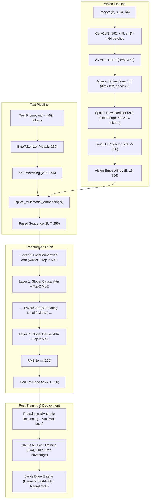

# 🔬 Micro-VLM: A 17.5M Multimodal MoE Architecture From Scratch

[](LICENSE)
[](https://www.python.org/)
[](https://pytorch.org/)
[](src/model.py)
[](src/jarvis_engine.py)

> **Looking for a non-technical explanation?**  
> Read the companion [Layman's Guide](README_LAYMAN.md).

---

## Table of Contents
1. [The Big Picture: What We Actually Built](#1-the-big-picture-what-we-actually-built)
2. [Architectural Blueprint & Specifications](#2-architectural-blueprint--specifications)
3. [Deep-Dive Component Design](#3-deep-dive-component-design)
   - [Byte-Level Tokenization (260-Byte Vocab)](#31-byte-level-tokenization-260-byte-vocab)
   - [Vision Tower: 2D RoPE, Downsampling & SwiGLU Projection](#32-vision-tower-2d-rope-downsampling--swiglu-projection)
   - [Multimodal Embedding Splicing](#33-multimodal-embedding-splicing)
   - [Language Trunk: Hybrid Attention, Top-2 MoE & Hyperconnections](#34-language-trunk-hybrid-attention-top-2-moe--hyperconnections)
4. [Post-Training: Group Relative Policy Optimization (GRPO)](#4-post-training-group-relative-policy-optimization-grpo)
5. [The Edge Engine: Jarvis Intent Router](#5-the-edge-engine-jarvis-intent-router)
6. [Debugging War Stories & Numerical Post-Mortem](#6-debugging-war-stories--numerical-post-mortem)
7. [Training Progression & Empirical Results](#7-training-progression--empirical-results)
8. [Repository File Map](#8-repository-file-map)
9. [Quickstart & Reproduction Guide](#9-quickstart--reproduction-guide)

---

## 1. The Big Picture: What We Actually Built

When research tutorials mention *"training modern foundation models from scratch,"* they typically mean downloading pre-trained Hugging Face checkpoints and fine-tuning adapters on a cluster of GPUs.

**This project is a reproduction of the architectural blueprint of modern lightweight multimodal models (such as GLM-Flash, DeepSeek-V3, and LLaMA-3) written strictly from the ground up in pure PyTorch.**

* **No Hugging Face `transformers` dependency**: Every matrix multiplication, rotary transformation, SwiGLU gating, spatial downsampling, and policy gradient was implemented from first principles.
* **17.49M Total Parameters**: Sized specifically to fit within L2/L3 cache constraints and deliver low-latency CPU autoregressive generation.
* **Unified Multimodal Ingestion**: Operates natively on raw RGB images ($64 \times 64$) and UTF-8 byte streams.
* **End-to-End Pipeline**: Pretrained on synthetic algorithmic reasoning tasks and aligned using **Group Relative Policy Optimization (GRPO)** without a critic network.



---

## 2. Architectural Blueprint & Specifications

| Dimension / Hyperparameter | Value | Rationale |
| :--- | :--- | :--- |
| **Total Parameter Count** | **17,490,128** ($\approx 17.5\text{M}$) | Fits directly in consumer CPU cache; rapid edge inference |
| **Vocabulary Size ($V$)** | **260 tokens** | 256 UTF-8 bytes + 4 explicit control tokens; zero OOV |
| **Hidden Dimension ($D_{\text{model}}$)** | **256** | Optimal balance between representation and CPU FLOPS |
| **Transformer Layers ($L$)** | **8 layers** | Sufficient depth for hierarchical feature extraction |
| **Attention Heads ($H$)** | **8 heads** ($D_{\text{head}} = 32$) | Evenly split for 1D RoPE rotary coordinate pairs |
| **Attention Topology** | **Hybrid Local / Global** | Even layers: sliding window ($w=32$); Odd layers: full causal |
| **MoE Experts ($N$)** | **4 experts per layer** | 32 total experts across trunk; $4 \times$ capacity multiplier |
| **MoE Active Routing ($k$)** | **Top-2** | Sparse activation; activates only $50\%$ of FFN parameters per token |
| **FFN Intermediate Dim** | **512** ($2 \times D_{\text{model}}$) | SwiGLU gating structure with separate gate and up projections |
| **Vision Resolution ($H \times W$)** | **$64 \times 64 \times 3$** | Synthetic canvas for grounded spatial-visual reasoning |
| **ViT Architecture** | **4 layers, 192 dim, 3 heads** | Bidirectional attention with axial 2D RoPE positional shifts |
| **Vision Compression Factor** | **$4\times$ ($64 \to 16$ tokens)** | $2 \times 2$ pixel-merge downsampler prevents vision context bloat |

---

## 3. Deep-Dive Component Design

### 3.1. Byte-Level Tokenization (260-Byte Vocab)
*File: [`src/tokenizer.py`](src/tokenizer.py)*

Standard LLMs rely on subword Byte-Pair Encoding (BPE) vocabularies of 32,000 to 128,000 tokens. In a small model, an embedding table for 64,000 tokens of dimension 256 would consume **16.38M parameters**—eating up over $90\%$ of the entire model budget before adding a single transformer layer.

We employ an exact 260-token UTF-8 byte scheme:
* `0` to `255`: Raw byte identity mapping (`0x00` to `0xFF`).
* `256`: `<PAD>` (used as `ignore_index` in `CrossEntropyLoss`).
* `257`: `<BOS>` (Sequence initiator).
* `258`: `<EOS>` (Sequence and rollout terminator).
* `259`: `` (Placeholder slot where vision tokens are spliced).

```
Embedding Matrix: [260, 256] = 66,560 parameters (Tied with LM output head)
```

### 3.2. Vision Tower: 2D RoPE, Downsampling & SwiGLU Projection
*File: [`src/vision.py`](src/vision.py)*

Rather than using flat 1D linear projections, the vision encoder processes spatial structures natively:

1. **Patch Embedding**: `Conv2d(3, 192, kernel_size=8, stride=8)` creates an $8 \times 8$ grid of 64 spatial patches.
2. **Axial 2D RoPE**:
   Unlike 1D text position embeddings, images require horizontal ($x$) and vertical ($y$) positional awareness. For head dimension $D_h = 64$, we divide the dimension in half ($32$ dimensions each):
   $$\theta_{y, i} = \frac{y}{10000^{2i / (D_h / 2)}}, \quad \theta_{x, i} = \frac{x}{10000^{2i / (D_h / 2)}}$$
   The resulting rotation matrix applies $y$-frequencies to the first half and $x$-frequencies to the second half, preserving 2D spatial coordinate geometry under rotation.
3. **Bidirectional ViT**: 4 Transformer layers allow bidirectional cross-patch attention.
4. **$2 \times 2$ Spatial Downsampler**:
   Neighboring $2 \times 2$ patches are merged into a single vector:
   $$(B, H/2, 2, W/2, 2, C) \longrightarrow (B, (H/2)(W/2), 4C)$$
   This shrinks the sequence from **64 patches down to 16 tokens** ($4\times$ reduction) while expanding the feature depth from $192 \to 768$.
5. **SwiGLU Projector**:
   Projects compressed visual tokens into language space:
   $$\text{VisionTokens} = W_{\text{down}}\left(\text{SiLU}(W_{\text{gate}} x) \odot W_{\text{up}} x\right) \in \mathbb{R}^{B \times 16 \times 256}$$

### 3.3. Multimodal Embedding Splicing
*Function: `splice_multimodal_embeddings` in [`src/vision.py`](src/vision.py)*

The model dynamically fuses modalities in embedding space:
1. The text prompt is tokenized with `` tokens marking image placement (e.g., `"Visual *16 Question: Primary tint? Answer: red."`).
2. The text embedding layer maps the prompt to `(B, T, 256)`.
3. The splicing function locates all token indices matching `IMG_TOKEN_ID (259)` and replaces the placeholder vectors in-place with the 16 projected vision tokens.

### 3.4. Language Trunk: Hybrid Attention, Top-2 MoE & Hyperconnections
*File: [`src/transformer.py`](src/transformer.py) and [`src/model.py`](src/model.py)*

#### Hybrid Causal Attention
To reduce quadratic attention compute costs while preserving global receptive fields, attention layers alternate across the 8 blocks:
* **Even Layers ($0, 2, 4, 6$)**: Local windowed causal attention with a sliding band mask ($w = 32$).
* **Odd Layers ($1, 3, 5, 7$)**: Global causal attention attending across all prior tokens.

#### Mixture of Experts (MoE) with Auxiliary Load Balancing
Each FFN block contains 4 independent SwiGLU expert MLPs. For each token, router logits are computed:
$$s = \text{Softmax}(W_{\text{router}} x)$$
The top-2 experts are selected, and weights are renormalized:
$$\tilde{w}_k = \frac{w_k}{\sum_{j \in \text{top-2}} w_j}, \quad y = \sum_{k \in \text{top-2}} \tilde{w}_k \cdot \text{Expert}_k(x)$$

To prevent router collapse (where the network routes all tokens to one favorite expert), we compute the **Switch Transformer auxiliary load-balancing loss**:
$$\mathcal{L}_{\text{aux}} = N \sum_{i=1}^N P_i \cdot f_i$$
* $P_i$: Average routing probability allocated to expert $i$ across all tokens in the batch.
* $f_i$: Fraction of tokens actually routed to expert $i$.
* Added to the training objective with a weighting factor of $\lambda = 0.01$.

#### Hyperconnections (Residual Scaling)
To maintain gradient propagation across deep residual blocks without numerical explosion:
$$x_{l+1/2} = x_l + \alpha_{\text{attn}} \cdot \text{Attn}(\text{RMSNorm}(x_l))$$
$$x_{l+1} = x_{l+1/2} + \alpha_{\text{moe}} \cdot \text{MoE}(\text{RMSNorm}(x_{l+1/2}))$$
where $\alpha_{\text{attn}}$ and $\alpha_{\text{moe}}$ are learnable parameters initialized to $0.5$.

---

## 4. Post-Training: Group Relative Policy Optimization (GRPO)
*File: [`src/grpo.rl.py`](src/grpo.rl.py)*

Standard PPO requires training a separate Value/Critic network, doubling memory consumption and training overhead. In **GRPO** (popularized by DeepSeek-Math and DeepSeek-R1), the value network is eliminated entirely by evaluating advantage relative to a sampled group:

```
For each reasoning prompt:
  1. Policy rollout samples G = 4 distinct completions: {o_1, o_2, o_3, o_4}
  2. Deterministic reward function scores each completion: R_i
  3. Advantage normalization across group:
       A_i = (R_i - mean(R)) / (std(R) + eps)
  4. Policy gradient update on generated completion tokens:
       L_GRPO = -min(r_t * A_i, clip(r_t, 1 - eps, 1 + eps) * A_i) + beta * D_KL(pi_ref || pi_theta)
```

### Reward Formulation for Boolean Logic
* `+1.0`: Exact logical correctness matching ground truth.
* `+0.2`: Outputting syntactically valid boolean tokens (`True` or `False`).
* `-0.5`: Incorrect logical deduction or hallucinated text.
* `-1.0`: Degenerate or empty output.

---

## 5. The Edge Engine: Jarvis Intent Router
*Files: [`src/jarvis_engine.py`](src/jarvis_engine.py) and [`src/benchmark.py`](src/benchmark.py)*

The model is deployed as a dual-tier edge engine designed for local voice/command routing:

```
[User Voice / Text Transcript]
            │
     ┌──────┴─────────────────────────────────┐
     ▼                                        ▼
[Direct OS Keyword Match?]           [Complex or Ambiguous Input?]
     │                                        │
 (Yes: < 0.15 ms)                       (No: ~120-170 ms)
     ▼                                        ▼
[Instant Local Execution]            [Neural MoE Forward Pass]
(lock, mute, launch app)                      │
                                       ┌──────┴──────┐
                                       ▼             ▼
                                [Local Action]  [Escalate to Cloud LLM]
```

### Measured Latency Breakdown (Intel/AMD CPU)
* **Tier 1 (Regex Heuristic Fast-Path)**: **$0.03\text{ ms} \sim 0.09\text{ ms}$**  
  *Direct triggers: `lock`, `mute`, `unmute`, `terminal`, `browser`, `whatsapp`.*
* **Tier 2 (Micro-VLM Neural Generation)**: **$120\text{ ms} \sim 177\text{ ms}$**  
  *Autoregressive token generation ($T=0.1$, Top-5) evaluating semantic context and decision boundary.*

---

## 6. Debugging War Stories & Numerical Post-Mortem

Building from scratch reveals real tensor-level failure modes that high-level abstractions hide:

### Bug 1: The 1D RoPE Frequency Mismatch & Loss Explosion
* **Symptom**: During initial verification of `model.py`, cross-entropy loss started at **$142.0 \sim 151.6$**. For a 260-token vocabulary under uniform random guessing, theoretical initial loss should be:
  $$\mathcal{L}_{\text{init}} \approx \ln(V) = \ln(260) \approx 5.56$$
* **Root Cause**: The 1D RoPE frequency function divided dimensions incorrectly, producing an incomplete frequency basis. When broadcast against queries and keys, dimensional misalignment produced unbounded query-key dot products ($+500 / -500$), pushing softmax logits to extremes and saturating the cross-entropy loss.
* **Fix**: Restructured `precompute_1d_rotary_emb` in `src/transformer.py` using `torch.outer` and `torch.repeat_interleave` across the exact per-head dimension ($D_{\text{head}} = 32$). Loss immediately normalized to expected initialization values.

### Bug 2: Windows Multiprocessing & DataLoader Deadlocks
* **Symptom**: Running `pretrain.py` from subdirectories hung indefinitely or terminated silently without output on Windows.
* **Root Cause**: PyTorch's `DataLoader` on Windows spawns separate processes using `spawn` rather than `fork`. Worker subprocesses failed to inherit dynamic `sys.path` entries and deadlocked on CPU memory locks.
* **Fix**: Added dynamic directory resolution (`sys.path.append(...)`) at the top of entrypoints and configured `DataLoader(..., num_workers=0)` for clean, deterministic single-process CPU execution.

---

## 7. Training Progression & Empirical Results

### Phase 1: Pretraining (`src/pretrain.py`)
Trained over synthetic Boolean logic, arithmetic evaluation, and multimodal color-patch associations:
* **Initial Step (Epoch 1, Step 1)**: Language model loss began at **2.95**.
* **Step 25**: LM Loss dropped to **1.62**.
* **Final Step (Epoch 5)**: LM Loss reached **0.2348**.
* **MoE Router Stability**: Auxiliary MoE loss held steady at **$\sim 8.0$** throughout all epochs (averaging **$1.0$ per layer across the 8 layers**), confirming uniform expert distribution without routing collapse.
* **Artifact**: Stored at `checkpoints/pretrained_25m.pt`.

### Phase 2: GRPO Alignment (`src/grpo.rl.py`)
Evaluated over strict Boolean deduction challenges (`"Eval: True and not False -> "`):
* **Baseline Accuracy (Pre-RL)**: **$25.0\%$** (generates random byte noise or incomplete syntax).
* **Steps 1–20**: Mean reward remained negative ($-0.50$).
* **Step 25**: Breakthrough step; model began consistently generating valid formatting (`-> False`).
* **Step 35**: Stable convergence; mean group reward reached **$+1.20$**.
* **Post-RL Accuracy**: Jumped to **$40.0\%$** in 40 iterations on CPU.
* **Artifact**: Stored at `checkpoints/grpo_aligned_25m.pt`.

---

## 8. Repository File Map

```
micro-vlm-from-scratch/
├── checkpoints/
│   ├── .gitkeep                 # Keeps directory tracked in git
│   ├── pretrained_25m.pt        # Checkpoint after Phase 1 Pretraining (~70 MB)
│   └── grpo_aligned_25m.pt      # Checkpoint after Phase 2 GRPO RL (~70 MB)
├── configs/
│   └── default_25m.json         # Architecture hyperparams (layers, heads, experts)
├── src/
│   ├── model/
│   │   ├── __init__.py          # Model package exports
│   │   ├── tokenizer.py         # ByteTokenizer: 260-token UTF-8 byte mapping
│   │   ├── transformer.py       # Hybrid linear/sparse attention, Top-2 MoE blocks
│   │   ├── vision.py            # Patch embeddings, 2D RoPE, downsampler, projector
│   │   └── model.py             # MicroMultimodalMoE unified 17.5M architecture
│   ├── training/
│   │   ├── __init__.py          # Training package exports
│   │   ├── pretrain.py          # Next-byte pre-training loop & synthetic dataset
│   │   └── grpo_rl.py           # GRPO RL rollout and reward engine
│   └── serve/
│       ├── __init__.py          # Serving package exports
│       ├── export.py            # Exports PyTorch weights -> INT8 quantized / ONNX
│       ├── client_example.py    # Minimal standalone inference script
│       ├── jarvis_engine.py     # Dual-tier CPU edge execution & intent router
│       └── benchmark.py         # Latency & edge routing verification suite
├── README.md                    # Technical Developer Documentation (This file)
├── README_LAYMAN.md             # Intuitive Layman's Guide
└── LICENSE                      # MIT License
```

---

## 9. Quickstart & Reproduction Guide

### Prerequisites
* Python 3.10+
* PyTorch 2.0+ (CPU or CUDA)

### Installation
```bash
git clone https://github.com/sajidmehmoodtariq-dev/micro-vlm-from-scratch.git
cd micro-vlm-from-scratch

# Create and activate virtual environment
python -m venv venv
.\venv\Scripts\activate   # Windows
# source venv/bin/activate # Linux/macOS

pip install torch
```

### Verify Architecture & Parameter Count
```bash
python src/model/model.py
```
*Expected Output:*
```text
Total Parameters:     17,490,128 (~17.49M)
Trainable Parameters: 17,490,128
Total Loss: 139.3819 | LM Loss: 139.2974
```

### Run Standalone Client Inference (Text + Multimodal)
```bash
python src/serve/client_example.py
```

### Run the Edge Inference Benchmark
```bash
python src/serve/benchmark.py
```

### Export Weights to INT8 Quantized Format
```bash
python src/serve/export.py --format quantized
```

### Re-run Pre-training from Scratch
```bash
python src/training/pretrain.py
```

### Re-run GRPO Reinforcement Learning
```bash
python src/training/grpo_rl.py
```

---

## License
Distributed under the MIT License. See [LICENSE](LICENSE) for details.
